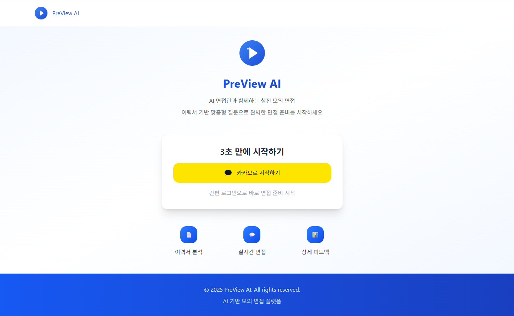
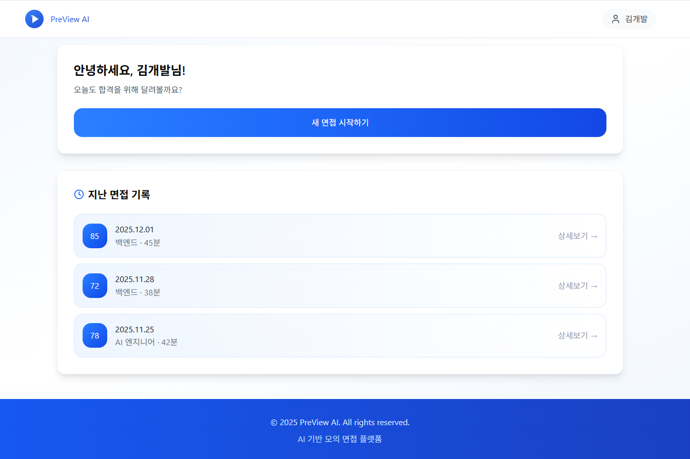
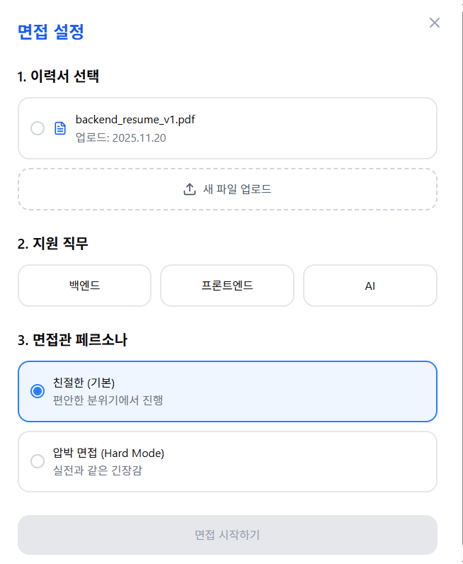
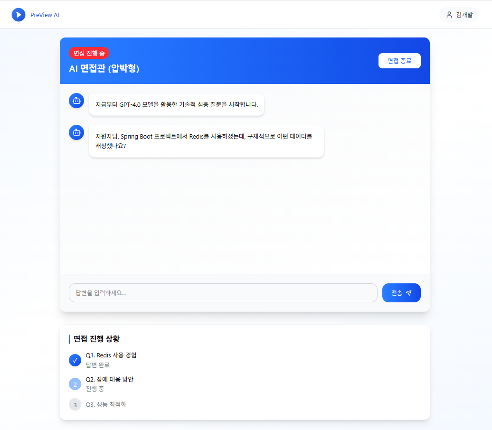
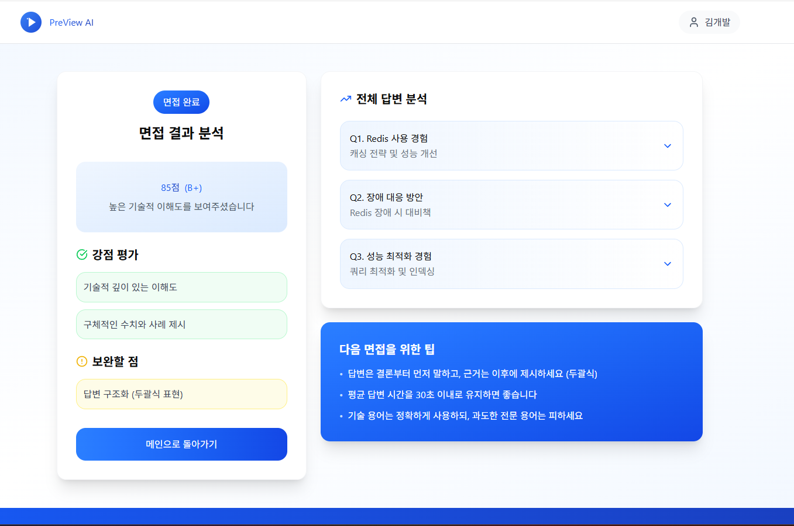

# PreView AI 와이어프레임 명세서

## 문서 정보

- **문서명**: PreView AI 화면 설계 및 기능 명세서
- **버전**: v1.0.0
- **작성일**: 2025.12.04
- **작성자**: [고동현](https://github.com/rhehdgus8831)
- **최종 수정일**: 2025.12.04

-----

## 1\. 개요 (Overview)

본 문서는 **PreView AI** 서비스의 핵심 화면 구성과 기능적 요구사항을 정의합니다.
사용자는 이 플랫폼을 통해 이력서를 업로드하고, AI 면접관과 실시간으로 대화하며 면접 실력을 향상시킬 수 있습니다.
직관적인 UI를 통해 복잡한 설정 없이 즉시 면접을 시작하고, 객관적인 데이터 기반의 피드백을 확인하는 경험을 제공하는 것을 목표로 합니다.

## 2\. 사용자 흐름 (User Flow)

사용자는 랜딩 페이지에서 카카오 로그인으로 진입하여, 대시보드에서 새로운 면접을 설정하고 진행한 뒤 결과를 확인합니다.

> **✅ 서비스 진입**: `[AUTH-001] 랜딩 페이지` → `카카오 로그인` → `[MAIN-001] 메인 대시보드`
> **✅ 면접 설정**: `[MAIN-001] 메인 대시보드 (새 면접 시작 클릭)` → `[INT-001] 면접 설정 모달`
> **✅ 면접 진행**: `[INT-001] 설정 완료` → `[INT-002] 면접 진행 채팅방 (AI와 대화)`
> **✅ 결과 확인**: `[INT-002] 면접 종료` → `[RES-001] 결과 리포트 페이지`

- 보다 자세한 전체 사용자 흐름은 [사용자 흐름도 명세서](사용자%20흐름도%20명세서.md)를 참고해주세요.

-----

## 3\. 화면 상세 명세 (Screen Specifications)

### 3.1. [AUTH-001] 랜딩 페이지

- **화면 설명**: 비로그인 사용자가 서비스에 처음 접속했을 때 마주하는 소개 페이지입니다. 서비스의 핵심 가치를 전달하고 로그인을 유도합니다.

- **진입 조건**: 비로그인 상태로 서비스 URL 접속 시.

- **참고 이미지**:

- **레이아웃 및 구성 요소**

| ID | 구분 | 요소명 | 설명 |
|:---|:---|:---|:---|
| 1-1 | 헤더 | 서비스 로고 | 좌측 상단에 위치한 PreView AI 로고입니다. |
| 1-2 | 텍스트 | 메인 카피 | "AI 면접관과 함께하는 실전 모의 면접" 등 핵심 가치를 전달하는 문구입니다. |
| 1-3 | 텍스트 | 서브 카피 | "이력서 기반 맞춤형 질문으로 완벽한 면접 준비를 시작하세요" 등 부가 설명입니다. |
| 1-4 | 컨테이너 | 로그인 카드 | 화면 중앙에 위치한 흰색 카드 형태의 컨테이너입니다. |
| 1-5 | 텍스트 | 유도 문구 | "3초 만에 시작하기" 등 로그인을 유도하는 타이틀입니다. |
| 1-6 | 버튼 | 카카오 로그인 | [카카오로 시작하기] 노란색 버튼입니다. 클릭 시 카카오 OAuth 인증을 진행합니다. |
| 1-7 | 아이콘 | 기능 소개 아이콘 | 하단에 이력서 분석, 실시간 면접, 상세 피드백을 상징하는 아이콘 3개가 배치됩니다. |
| 1-8 | 푸터 | 저작권 정보 | 서비스 저작권 및 관련 정보가 표시됩니다. |

- **상호작용 및 정책**
    - **'카카오 로그인' 버튼 (1-6) 클릭 시**: 카카오 인증 서버로 리다이렉트되며, 인증 성공 시 `[MAIN-001] 메인 대시보드`로 이동합니다. 기존 회원이 아닐 경우 회원가입 처리가 동시에 진행됩니다.

-----

### 3.2. [MAIN-001] 메인 대시보드

- **화면 설명**: 로그인 후 진입하는 홈 화면으로, 새로운 면접을 시작하거나 과거의 면접 기록을 확인할 수 있습니다.

- **진입 조건**: 로그인 성공 시.

- **참고 이미지**:

- **레이아웃 및 구성 요소**

| ID | 구분 | 요소명 | 설명 |
|:---|:---|:---|:---|
| 2-1 | 헤더 | 사용자 프로필 | 우측 상단에 로그인한 사용자의 이름(또는 닉네임)이 표시됩니다. |
| 2-2 | 텍스트 | 웰컴 메시지 | "안녕하세요, [사용자명]님\!" 형태의 환영 문구가 표시됩니다. |
| 2-3 | 버튼 | 새 면접 시작하기 | 화면 중앙의 가장 큰 파란색 버튼(CTA)입니다. 클릭 시 `[INT-001] 면접 설정 모달`을 엽니다. |
| 2-4 | 섹션 | 지난 면접 기록 | 사용자가 이전에 진행했던 면접 리스트를 보여주는 영역입니다. |
| 2-5 | 리스트 | 히스토리 카드 | 각 면접 건에 대한 요약 정보(날짜, 직무, 점수)가 카드 형태로 표시됩니다. |
| 2-6 | 배지 | 점수 배지 | 히스토리 카드 좌측에 종합 점수(예: 85)가 색상 박스로 강조되어 표시됩니다. |
| 2-7 | 버튼 | 상세보기 링크 | 각 카드 우측의 화살표 또는 텍스트로, 클릭 시 해당 면접의 `[RES-001] 결과 리포트`로 이동합니다. |

- **상호작용 및 정책**
    - **'새 면접 시작하기' 버튼 (2-3) 클릭 시**: `[INT-001] 면접 설정 모달`이 팝업됩니다.
    - **'히스토리 카드' (2-5) 클릭 시**: 해당 회차의 상세 결과 페이지(`[RES-001]`)로 이동합니다.
    - 리스트는 최신순으로 정렬되며, 데이터가 많을 경우 무한 스크롤 또는 더보기 버튼으로 처리합니다.

-----

### 3.3. [INT-001] 면접 설정 모달

- **화면 설명**: 면접을 시작하기 전, 이력서를 선택하고 면접관의 성향(페르소나)을 설정하는 단계입니다.

- **진입 조건**: `[MAIN-001] 메인 대시보드`에서 '새 면접 시작하기' 버튼 클릭 시.

- **참고 이미지**:

- **레이아웃 및 구성 요소**

| ID | 구분 | 요소명 | 설명 |
|:---|:---|:---|:---|
| 3-1 | 타이틀 | 모달 제목 | "면접 설정" 텍스트가 표시됩니다. |
| 3-2 | 입력 | 이력서 선택 | 라디오 버튼으로 기존에 업로드한 이력서를 선택하거나, 목록에 표시합니다. |
| 3-3 | 버튼 | 새 파일 업로드 | 로컬에서 새로운 PDF 이력서를 업로드하는 버튼입니다. 업로드 시 목록에 자동 추가됩니다. |
| 3-4 | 선택 | 지원 직무 | [백엔드], [프론트엔드], [AI] 중 하나를 선택하는 버튼 그룹입니다. |
| 3-5 | 선택 | 면접관 페르소나 | [친절한(기본)], [압박 면접(Hard)] 중 면접관의 성향을 선택하는 라디오 버튼입니다. |
| 3-6 | 버튼 | 면접 시작하기 | 설정이 완료되면 활성화되는 하단 버튼입니다. 클릭 시 로딩 후 채팅방으로 이동합니다. |

- **상호작용 및 정책**
    - **이력서 파일**: PDF 형식만 지원하며, 업로드 시 서버에서 텍스트 파싱이 진행됩니다.
    - **'면접 시작하기' 버튼 (3-6) 클릭 시**:
        - 필수 항목(이력서, 직무, 페르소나)이 선택되지 않았다면 경고 토스트 메시지를 노출합니다.
        - 모든 설정이 완료되면 로딩 화면(질문 생성 중)을 거쳐 `[INT-002] 면접 진행 채팅방`으로 이동합니다.

-----

### 3.4. [INT-002] 면접 진행 채팅방

- **화면 설명**: AI 면접관과 실시간으로 문답을 주고받는 대화형 인터페이스입니다.

- **진입 조건**: `[INT-001] 면접 설정 모달`에서 설정 완료 후.

- **참고 이미지**:

- **레이아웃 및 구성 요소**

| ID | 구분 | 요소명 | 설명 |
|:---|:---|:---|:---|
| 4-1 | 헤더 | 면접관 정보 | "AI 면접관 (압박형)" 등 현재 설정된 페르소나와 "면접 진행 중" 상태 배지가 표시됩니다. |
| 4-2 | 버튼 | 면접 종료 | 우측 상단에 위치하며, 클릭 시 면접을 중단하고 결과 페이지로 이동합니다. |
| 4-3 | 영역 | 채팅 로그 | AI와 사용자의 대화 내용이 말풍선 형태로 스크롤 영역에 표시됩니다. (AI: 좌측, 사용자: 우측) |
| 4-4 | 텍스트 | AI 메시지 | AI가 생성한 질문입니다. SSE(Server-Sent Events)를 통해 타자 치듯 실시간으로 출력됩니다. |
| 4-5 | 입력 | 답변 입력창 | 사용자가 답변을 입력하는 텍스트 박스입니다. |
| 4-6 | 버튼 | 전송 버튼 | 입력한 답변을 서버로 전송합니다. 엔터키로도 동작합니다. |
| 4-7 | 섹션 | 면접 진행 상황 | 좌측 하단(또는 별도 패널)에 현재 질문 단계(Q1, Q2...)와 진행 상태를 보여줍니다. |

- **상호작용 및 정책**
    - **답변 전송 시**: 사용자의 답변이 말풍선으로 등록되고, 입력창은 비활성화됩니다. AI가 답변을 분석하고 다음 질문(꼬리 질문)을 생성하는 동안 "AI가 입력 중입니다..." 인디케이터가 표시됩니다.
    - **면접 종료 버튼 (4-2) 클릭 시**: "정말 종료하시겠습니까?" 확인 팝업 후, 확인 시 `[RES-001] 결과 리포트`로 이동하여 분석 결과를 생성합니다.

-----

### 3.5. [RES-001] 결과 리포트 페이지

- **화면 설명**: 면접이 종료된 후, AI가 분석한 종합 점수와 상세 피드백을 보여주는 페이지입니다.

- **진입 조건**: `[INT-002] 면접 진행 채팅방`에서 면접 종료 시.

- **참고 이미지**:

  

- **레이아웃 및 구성 요소**

| ID | 구분 | 요소명 | 설명 |
|:---|:---|:---|:---|
| 5-1 | 타이틀 | 페이지 제목 | "면접 결과 분석" 텍스트와 완료 뱃지가 표시됩니다. |
| 5-2 | 카드 | 종합 점수 | 100점 만점 기준의 점수와 등급(예: B+) 및 한 줄 총평이 표시되는 메인 카드입니다. |
| 5-3 | 섹션 | 강점 평가 | AI가 분석한 사용자의 강점 키워드(예: 기술적 이해도, 구체적 사례)가 초록색 박스로 표시됩니다. |
| 5-4 | 섹션 | 보완할 점 | 개선이 필요한 부분(예: 답변 구조화, 두괄식 표현)이 노란색 경고 박스로 표시됩니다. |
| 5-5 | 리스트 | 상세 답변 분석 | 우측 영역에 Q1, Q2, Q3 등 질문별로 아코디언 메뉴가 배치됩니다. |
| 5-6 | 텍스트 | 상세 피드백 | 아코디언을 펼치면 해당 질문에 대한 내 답변과 AI의 구체적인 조언(Better Answer)이 표시됩니다. |
| 5-7 | 섹션 | 다음 면접 팁 | 하단 파란색 박스에 면접관 페르소나 기반의 실전 팁 3가지가 제공됩니다. |
| 5-8 | 버튼 | 메인으로 | 클릭 시 `[MAIN-001] 메인 대시보드`로 돌아갑니다. |

- **상호작용 및 정책**
    - **상세 답변 분석 (5-5) 클릭 시**: 해당 질문 항목이 펼쳐지며 세부 피드백 내용을 볼 수 있습니다.
    - **'메인으로' 버튼 (5-8) 클릭 시**: 대시보드로 이동하며, 방금 진행한 면접은 히스토리에 저장됩니다.

-----

## 변경 이력

| 버전 | 날짜 | 변경 내용 | 작성자 |
|:---|:---|:---|:---|
| v1.0.0 | 2025.12.04 | 초기 문서 작성 (SignBell 양식 적용) | [고동현](https://github.com/rhehdgus8831) |