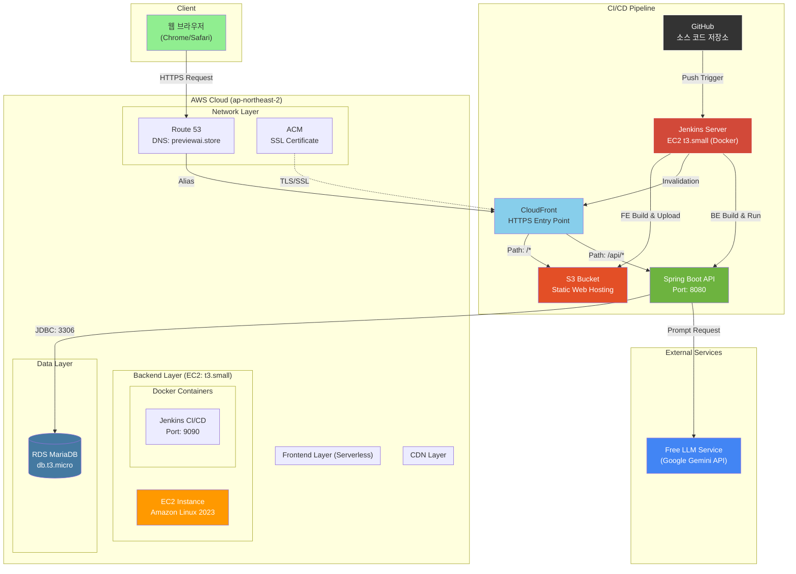
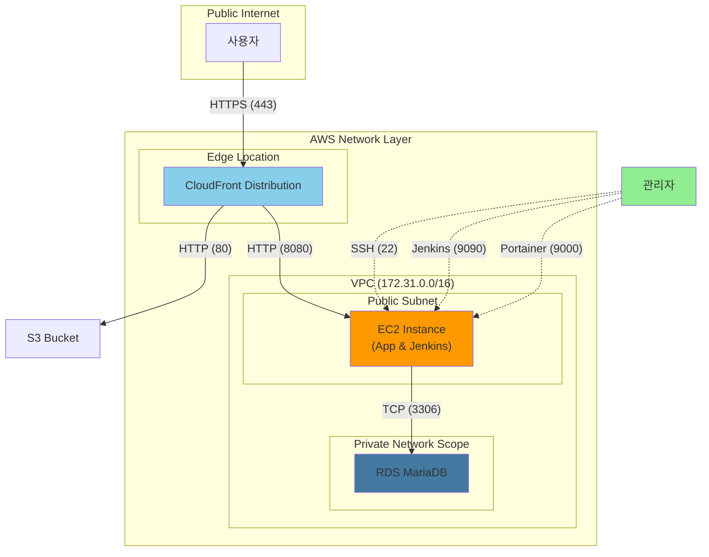
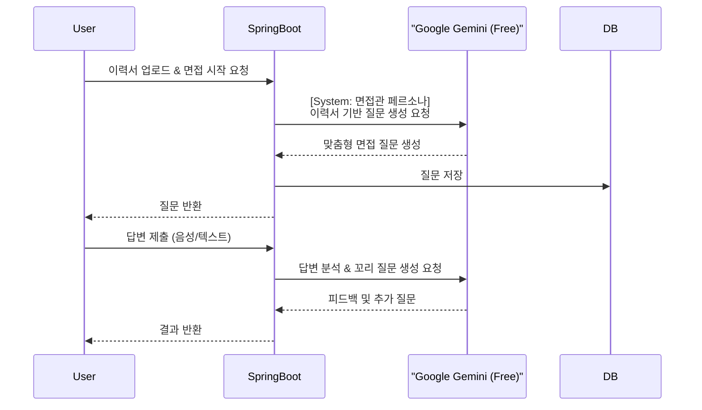
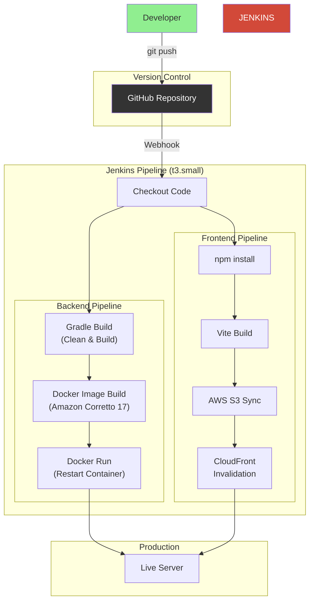

#  PreView (AI 모의 면접관) - 인프라 아키텍처

본 문서는 **PreView (AI 모의 면접관)** 서비스의 **인프라 아키텍처**를 정의합니다.
CI/CD 자동화 파이프라인, AWS 클라우드 인프라, LLM 연동 구조, 네트워크 및 보안 체계 등 전체 시스템 구조를 설명합니다.

**작성자:** [고동현](https://github.com/rhehdgus8831)
**문서 버전:** v1.0.0
**최초 작성일:** 2025.12.02

**대상 독자:**

- DevOps 엔지니어: 배포 파이프라인 유지보수 및 서버 모니터링
- 백엔드 개발자: API 서버 구조 및 AI 모델 연동 흐름 파악
- 프론트엔드 개발자: 정적 호스팅 및 CDN 캐싱 정책 이해
- 평가자/면접관: 클라우드 인프라 구축 역량 및 아키텍처 설계 능력 평가

-----

## 1\. 전체 인프라 아키텍처 개요

사용자의 요청은 \*\*CloudFront(CDN)\*\*를 단일 진입점으로 하여 \*\*프론트엔드(S3)\*\*와 \*\*백엔드(EC2)\*\*로 라우팅됩니다. 백엔드 서버는 \*\*무료 외부 LLM 서비스(Google Gemini API)\*\*와 통신하여 AI 면접 기능을 수행합니다.

-----

## 2\. 네트워크 계층 아키텍처

보안을 위해 모든 클라이언트 요청은 \*\*HTTPS(443)\*\*로 암호화되며, 백엔드 서버의 포트(8080)는 외부에 직접 노출되지 않고 \*\*CloudFront(Reverse Proxy)\*\*를 통해서만 접근 가능하도록 구성했습니다.

-----

## 3\. 데이터 계층 및 AI 모델

### 3.1 데이터베이스 (RDS)

- **엔진**: MariaDB 10.6 (LTS)
- **인스턴스**: db.t3.micro (Free Tier)
- **보안**: EC2 보안 그룹에서의 인바운드 트래픽만 허용 (3306)

### 3.2 AI 모델 (LLM) 아키텍처

비용 절감을 위해 \*\*Google Gemini API (Free Tier)\*\*를 활용하여 고성능 AI 기능을 무료로 구현했습니다.

| 구성 요소 | 기술 스택 | 역할 |
|:---:|:---:|:---|
| **Model** | **Google Gemini 1.5 Flash (Free)** | 이력서 분석, 면접 질문 생성, 꼬리 질문 생성, 답변 피드백 |
| **Interface** | Spring AI / WebClient | Spring Boot에서 비동기(Non-blocking) 방식으로 API 호출 |
| **Prompt** | System Prompting | 면접관 페르소나 부여 및 답변 평가 기준 주입 |

-----

## 4\. CI/CD 파이프라인 상세

**Jenkins**를 활용하여 코드 푸시부터 배포까지 \*\*무중단(또는 최소 다운타임)\*\*에 가까운 자동화를 구현했습니다.

### 4.1 프론트엔드 파이프라인

1.  **Checkout**: GitHub에서 최신 React 코드 가져오기.
2.  **Install & Build**: Node.js 환경에서 `npm install` 및 `npm run build` 실행.
3.  **Deploy**: 빌드된 정적 파일(`dist/`)을 AWS S3 버킷에 동기화(`aws s3 sync`).
4.  **Invalidate**: CloudFront 캐시 무효화(`aws cloudfront create-invalidation`)로 즉시 반영.

### 4.2 백엔드 파이프라인

1.  **Checkout**: GitHub에서 Spring Boot 코드 가져오기.
2.  **Build**: Gradle Wrapper를 사용하여 `clean build` 실행 (Test 제외 옵션).
3.  **Containerize**: `Dockerfile`을 기반으로 새로운 도커 이미지 빌드 (`amazoncorretto:17` 베이스).
4.  **Redeploy**: 기존 컨테이너 중지/삭제 후 새로운 컨테이너 실행 (`docker run`).

<!-- end list -->

-----

## 5\. 인프라 구성 요소 상세 스펙

### 5.1 컴퓨팅 (AWS EC2)

- **인스턴스 타입**: **t3.small** (2 vCPU, 2GB RAM)
  - *선정 이유*: Jenkins와 Spring Boot 동시 구동 시 발생하는 t2.micro의 메모리 부족(OOM) 해결.
- **OS**: Amazon Linux 2023
- **메모리 최적화**: Swap Memory 2GB 설정 (물리 2GB + 가상 2GB = 총 4GB 확보).

### 5.2 CDN 및 스토리지

- **CloudFront**:
  - **Alternate Domain**: `previewai.store`
  - **SSL**: ACM 인증서 연동 (US-East-1 리전 발급)
  - **Behavior**: `/api/*` 경로는 캐시 비활성화(`CachingDisabled`), 그 외는 S3 캐싱.
- **S3**:
  - **버킷명**: `previewai-frontend`
  - **설정**: 정적 웹 사이트 호스팅 활성화, 퍼블릭 액세스 허용(버킷 정책).

### 5.3 CI/CD 서버 (Jenkins)

- **실행 방식**: Docker in Docker (DinD)
  - EC2 호스트의 Docker Socket을 공유하여 컨테이너 내부에서 호스트의 Docker 제어.
- **도구**: Node.js 20, AWS CLI v2, Gradle(내장).

-----

## 6\. 비용 최적화 전략 (Monthly Cost)

학생/취준생 프로젝트 예산에 맞춰 \*\*프리티어(Free Tier)\*\*를 최대한 활용하고, LLM 비용까지 무료화하여 경제성을 극대화했습니다.

| 리소스 | 스펙/유형 | 예상 비용 | 비고 |
|:---:|:---:|:---:|:---|
| **EC2** | t3.small | 약 $15 | t2.micro 대비 성능 2배, Swap으로 안정성 확보 |
| **RDS** | db.t3.micro | $0 | AWS 프리티어 12개월 무료 제공 |
| **S3** | Standard | $0 | 5GB 스토리지 & 2만 건 요청 무료 |
| **CloudFront** | Data Transfer | $0 | 월 1TB 데이터 전송 무료 |
| **Route 53** | Hosted Zone | $0.50 | 도메인 호스팅 비용 (필수) |
| **Domain** | .store | 약 2,000원 | 연간 도메인 유지비 (이벤트가) |
| **AI API** | **Google Gemini** | **$0\*\* | **Free Tier (분당 15회 요청 무료)** |
| **합계** | - | **약 2만원/월** | 커피 4잔 값으로 전체 인프라 운영 |

-----

## 7\. 주요 트러블슈팅 이력

### 7.1 Jenkins 빌드 멈춤 현상 (OOM)

- **문제**: 배포 중 Jenkins가 "Waiting for next available executor" 상태로 멈춤.
- **원인**: EC2(`t2.micro`, 1GB RAM) 메모리 고갈로 인한 프로세스 행(Hang).
- **해결**:
  1.  인스턴스를 `t3.small`(2GB RAM)로 스케일 업.
  2.  리눅스 Swap Memory 2GB 추가 설정.
  3.  Docker System Prune으로 불필요한 이미지 주기적 정리.

### 7.2 Mixed Content (보안 혼합 콘텐츠) 에러

- **문제**: HTTPS가 적용된 프론트엔드에서 HTTP 백엔드 API 호출 시 브라우저 차단.
- **원인**: 보안 정책상 암호화된 페이지(HTTPS)에서 평문 통신(HTTP) 불가.
- **해결**: CloudFront를 **Reverse Proxy**로 설정.
  - 클라이언트 → `https://도메인/api` (HTTPS) → CloudFront → `http://EC2:8080` (HTTP).
  - 브라우저는 CloudFront와만 HTTPS 통신을 하므로 에러 해결.

-----

## 8\. 향후 개선 계획

1.  **AI 응답 속도 최적화**: LLM API 응답 대기 시간을 줄이기 위해 **Server-Sent Events (SSE)** 또는 **WebSocket** 스트리밍 적용.
2.  **무중단 배포**: 현재 `Restart` 방식의 배포로 인한 짧은 다운타임을 없애기 위해 **Blue/Green** 또는 **Rolling Update** 도입 고려.
3.  **모니터링**: CloudWatch 및 Slack 알림 연동을 통해 서버 상태 및 배포 결과 실시간 모니터링 구축.

## 변경 이력

| 버전 | 날짜 | 변경 내용 | 작성자 |
|---|---|---|---|
| v1.0.0 | 2025.12.02 | 초기 문서 작성 | [고동현](https://github.com/rhehdgus8831) |